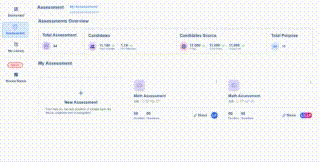

# Unstop Project

Welcome to the README file for the Unstop Frontend Project! This project showcases a frontend application built using React JS, Tailwind and HTML for Unstop.
The Unstop Frontend Project is a React.js application designed to showcase the frontend development skills and creativity of its developers.
The project demonstrates the use of various React components, state management, and responsive design principles.

### Checkout the live website [here](https://frontend-assessment-clone.netlify.app/)

## How the website looks like

